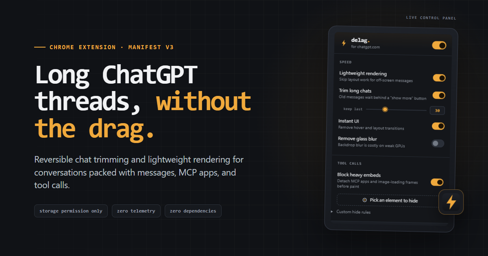

<div align="center">
  
  <h1>GPT Delagger</h1>
  <p><strong>Make long ChatGPT conversations feel light again.</strong></p>
  <p>
    A tiny, privacy-first Chrome extension that trims rendering work from long chats<br>
    and detaches heavy MCP, connector, and tool-call embeds.
  </p>
  <p>
    <a href="LICENSE"></a>
    
    
  </p>
  <p>
    <a href="#install-in-60-seconds">Install</a> ·
    <a href="#what-it-does">Features</a> ·
    <a href="#privacy-by-design">Privacy</a> ·
    <a href="#development">Contribute</a>
  </p>
</div>



> [!IMPORTANT]
> GPT Delagger is an independent, unofficial project. It is not affiliated with or endorsed by OpenAI.

## Why GPT Delagger?

Long ChatGPT threads can become expensive to lay out and repaint. Tool calls can add animated frames, sandboxed apps, status cards, and other UI that stays mounted after you are done with it. GPT Delagger reduces that browser-side work without changing or deleting the conversation stored by ChatGPT.

| | Feature | What it changes |
| --- | --- | --- |
| ⚡ | **Lightweight rendering** | Uses `content-visibility: auto` so off-screen messages skip layout and paint work. |
| ✂️ | **Reversible chat trimming** | Detaches old turns from the live DOM and restores them on demand. Keep anywhere from 0 to 100 recent turns mounted. |
| 🧩 | **Heavy embed blocking** | Detaches MCP apps, connector cards, tool-run UI, failure fallbacks, and image-generation loading frames. |
| 🎯 | **Zap mode** | Point at stubborn UI, widen or narrow the selection, and save a reversible custom hide rule. |
| 🏎️ | **Instant UI** | Removes transitions and smooth scrolling that can make overloaded pages feel slower. |
| 🪶 | **Optional blur removal** | Disables expensive backdrop blur on weaker GPUs. |

Every optimization can be switched off instantly. Detached nodes are held in memory with lightweight placeholders and restored in their original position; GPT Delagger does not delete server-side messages.

### What the default settings change

On the included 141-turn offline fixture, GPT Delagger's default settings reduce the live page from 141 turns to 30 and from 839 DOM elements to 175.

| State | Live turns | Live DOM elements |
| --- | ---: | ---: |
| GPT Delagger off | 141 | 839 |
| Default settings | 30 | 175 |

That means 107 old turns and 4 tool embeds are detached, leaving about **79% fewer live DOM elements** for the browser to manage.

> [!NOTE]
> Measured with `test/mock.html` on v1.4.0. This fixture demonstrates DOM reduction; it is not a universal FPS or latency claim.

## Install in 60 seconds

### From a GitHub release

1. Download the latest `gpt-delagger-v*.zip` from [Releases](https://github.com/throwingogo-hub/chatgpt-delagger/releases/latest).
2. Extract the ZIP to a permanent folder.
3. Open `chrome://extensions` (or `edge://extensions`).
4. Enable **Developer mode**.
5. Choose **Load unpacked** and select the extracted folder.
6. Pin the ⚡ icon and open its control panel from a ChatGPT conversation.

### From source

```bash
git clone https://github.com/throwingogo-hub/chatgpt-delagger.git
```

Then load the cloned folder with the same **Load unpacked** flow above.

When updating an unpacked installation, pull or replace the files, click **Reload** on `chrome://extensions`, and reload open ChatGPT tabs. Popup setting changes apply live after the content script is active.

## What it does

### Trim long chats

Choose how many recent turns stay mounted. Older turns are replaced by comment placeholders before paint. **Show more**, **Show all**, or disabling trimming restores the original nodes. A value of `0` detaches every turn until you reveal some.

### Block heavy embeds

The blocker targets known tool UI rather than hiding arbitrary prose. It handles native connector headers, sandboxed app iframes, tool-role messages, compact run-status cards, connector failure UI, separators, and large image-generation loading frames. Completed images and ordinary answers are preserved.

### Zap anything the heuristic misses

Open the popup and choose **Pick an element to hide**:

- Hover an element to preview the selection.
- Press <kbd>↑</kbd> to widen the selection or <kbd>↓</kbd> to narrow it.
- Click to save the generated selector.
- Press <kbd>Esc</kbd> to cancel.

Saved selectors appear under **Custom hide rules**. Delete a line to restore its matches. The generator refuses selectors that would hide too much of the page.

## Privacy by design

GPT Delagger has no analytics, no network requests, no remote code, and no external dependencies.

| Access | Why it is needed |
| --- | --- |
| `storage` | Syncs your toggles, trim count, and custom hide rules through Chrome. |
| `chatgpt.com` / `chat.openai.com` | Runs the local content script only on ChatGPT pages. |

Your conversations never leave the browser through this extension. See [SECURITY.md](SECURITY.md) for vulnerability reporting.

## Honest expectations

This extension targets browser rendering cost: scrolling, repainting, hover effects, and the amount of live DOM. Typing may also improve, but ChatGPT's own React state updates still contribute to input latency. For extremely large conversations, a fresh chat remains the most effective reset.

ChatGPT's markup changes regularly. GPT Delagger uses conservative heuristics and regression fixtures, but a site update can temporarily break a detector. If that happens, use Zap mode and [open a bug report](https://github.com/throwingogo-hub/chatgpt-delagger/issues/new?template=bug_report.yml).

## Development

There is no build step and no package install.

```bash
node test/logic-smoke.mjs
```

For an offline visual fixture, open `test/mock.html` in a browser. It creates a large fake conversation with tool cards and exposes `window.__gptdelag` for manual checks.

```text
manifest.json        Chrome Manifest V3 configuration
content.js           Rendering, trimming, blocker, and Zap-mode engine
popup/               Extension control panel
icons/               Extension icons
test/mock.html       Offline long-chat fixture
test/logic-smoke.mjs Zero-dependency regression checks
```

Contributions are welcome. Start with [CONTRIBUTING.md](CONTRIBUTING.md), especially if you can provide a minimal DOM fixture for a ChatGPT markup change.

## Support the project

If GPT Delagger makes a long conversation usable again, please **star the repository**. Stars help other people discover it. Bug reports, detector fixtures, and small focused pull requests are equally valuable.

## License

[MIT](LICENSE) © 2026 GPT Delagger contributors.
